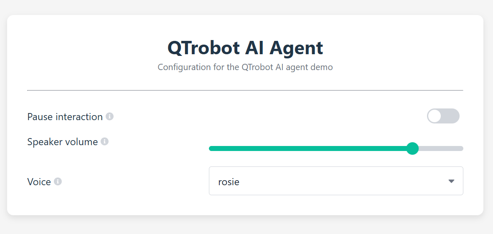

# QTrobot AI Agent

**Fluent, multilingual, multimodal conversation on QTrobotAI@Edge**

**QTrobot AI Agent** turns [QTrobot](https://luxai.com/humanoid-social-robot-for-research-and-teaching/) into a natural, expressive, and extensible conversational assistant. It combines interruption-aware speech-to-speech interaction, automatic language recognition, multilingual voice cloning with natural prosody, camera-grounded visual understanding, local document search, long-term memory, reminders, robot actions, and background web research in one complete reference application.

This is more than a voice chatbot. QTrobot understands when a person has actually finished speaking, tolerates natural pauses, supports barge-in, suppresses stale responses, keeps recent conversation context, calls tools in parallel, and can continue talking while longer-running agents work in the background.

**Private and offline by design.** Audio, camera images, documents, and conversation memory stay on QTrobot. After initial installation, the complete assistant can run without an internet connection; only optional web search requires online access.

> This repository is both a ready-to-run demo and a clean baseline for building custom QTrobot tools, agents, personalities, and knowledge assistants.



## Table of contents

- [Why this demo feels natural](#why-this-demo-feels-natural)
- [Features](#features)
- [Example interactions](#example-interactions)
- [Technology stack](#technology-stack)
- [Getting started](#getting-started)
  - [Requirements](#requirements)
  - [1. Verify or install the robot services](#1-verify-or-install-the-robot-services)
  - [2. Install the application](#2-install-the-application)
  - [3. Run the assistant](#3-run-the-assistant)
- [Configuration and Web UI](#configuration-and-web-ui)
- [Customization](#customization)
  - [Customize QTrobot's role and personality](#customize-qtrobots-role-and-personality)
  - [Use your own documents](#use-your-own-documents)
  - [Enable long-term memory](#enable-long-term-memory)
  - [Enable background web search](#enable-background-web-search)
  - [Choose or add a voice](#choose-or-add-a-voice)
- [Command-line options](#command-line-options)
- [Extending the demo](#extending-the-demo)
- [Troubleshooting](#troubleshooting)
- [Privacy and network use](#privacy-and-network-use)
- [License and support](#license-and-support)

## Why this demo feels natural

Traditional voice assistants often react to every short silence, cut users off, lose track of interrupted responses, or require a fixed language. This application uses the full S2S runtime to make spoken interaction feel much closer to a real conversation:

- Semantic end-of-turn detection distinguishes a thoughtful pause from a completed turn.
- Smart Turn helps keep long or hesitant speech as one coherent user turn.
- Audio, events, tool calls, agents, and robot playback run concurrently.

The result is a fluent, responsive interaction in which users can speak naturally instead of adapting their speech to the robot.

## Features

- **Natural, interruption-aware conversation**
  Silero VAD and Smart Turn understand speech boundaries and natural pauses. Users can interrupt QTrobot at any time without hearing stale audio afterward.

- **Automatic multilingual conversation**
  NVIDIA Parakeet-TDT automatically detects the spoken language. The bundled end-to-end setup supports English, French, German, Italian, Portuguese, Russian, and Spanish without selecting a language or restarting the service.

- **One consistent multilingual personality**
  The selected cloned Qwen3-TTS voice remains the robot's voice as the conversation changes language, preserving a consistent identity across multilingual interactions.

- **Expressive speech and voice cloning**
  Qwen3-TTS generates natural rhythm, emphasis, and contextual prosody. The demo includes the `rosie` and `aiden` voices, and a short WAV recording can give QTrobot a new custom voice.

- **On-device multimodal intelligence**
  The default Gemma 4 12B model runs through llama.cpp on the Jetson AGX Orin and receives text, conversation context, tool results, and camera images.

- **On-demand visual perception**
  When a question requires the current scene, QTrobot captures a fresh camera image and supplies it to the multimodal model. Responses are grounded in what is actually visible rather than an old scene description.

- **Extensible tool calling through MCP**
  Application tools and QTrobot SDK tools are discovered through MCP. Independent tool calls can run in parallel while audio and events continue flowing.

- **Physical robot actions**
  QTrobot combines facial expressions and gestures with speech to create more natural, embodied, and engaging interactions. It can also change its speaker volume upon user request. 

- **Concurrent reminders and timers**
  QTrobot can set, list, and cancel multiple reminders. A due reminder enters the ongoing conversation as a trusted background event at the correct time. Reminders are held in memory and do not survive an application restart.

- **Agentic document RAG**
  Local PDF, Markdown, and text documents are indexed for semantic retrieval and reranked per query. The model decides when a question is related to the loaded knowledge and calls document search before answering.

- **Persistent long-term conversation memory**
  Optional long-term memory stores final user and assistant messages in JSON Lines format. Older conversations can later be retrieved semantically without replacing S2S's recent conversation context.

- **Background agentic web research**
  The optional web-search agent searches, refines queries, reads promising pages, and synthesizes an evidence-based result. It runs asynchronously, allowing the conversation to continue while research is in progress.

- **Embodied human attention**
  QTrobot tracks a nearby engaged person, smooths its gaze, avoids rapid switching, and performs occasional natural idle looks.

- **Live Web configuration**
  Paramify Web provides a browser interface for pausing interaction and changing speaker volume or voice while the application is running. Successful UI changes are saved back to the YAML configuration.

- **Reusable developer architecture**
  The MAGPIE S2S client is independent of QTrobot audio hardware. Tools, delayed background operations, and isolated agents have clear extension points for new applications.

## Example interactions

Once the assistant is ready, try prompts such as:

| Capability | Example |
|---|---|
| Natural conversation | *“Let me think for a moment... actually, tell me something interesting about space.”* |
| Language switching | *“Can we continue in French?”* followed later by *“Jetzt sprechen wir Deutsch.”* |
| Visual understanding | *“What do you see in front of you?”* |
| Parallel tools | *“What time is it, and what can you see right now?”* |
| Robot control | *“Please speak a little louder.”* or *“Move to your home position.”* |
| Reminders | *“Remind me in ten minutes to make a phone call.”* |
| Reminder management | *“What reminders do I have?”* |
| Document RAG | *“What are the QTrobot variants?”* |
| Research knowledge | *“What are the titles of some research papers that used QTrobot in elderly healthcare?”* |
| Long-term memory | *“What did we discuss during our previous conversation?”* |
| Background web agent | *“Search the web for the weather in Luxembourg this weekend.”* |


## Technology stack

| Component | Default technology | Role |
|---|---|---|
| Communication | [LuxAI MAGPIE](https://github.com/luxai-qtrobot/magpie) | Native audio, events, RPC, discovery, and MCP transport |
| Speech-to-speech runtime | [luxai-s2s-magpie](https://github.com/luxai-qtrobot/s2s-magpie) | Session state, VAD, turn taking, response ordering, tool events, and cancellation |
| Speech recognition | [NVIDIA Parakeet-TDT 0.6B v3](https://huggingface.co/nvidia/parakeet-tdt-0.6b-v3) | Fast multilingual ASR with automatic language detection |
| Language model | Gemma 4 12B IT Q8_0 through [llama.cpp](https://github.com/ggml-org/llama.cpp) | Local conversation, reasoning, multimodal understanding, and tool selection |
| Speech synthesis | [Qwen3-TTS 0.6B Base](https://huggingface.co/Qwen/Qwen3-TTS-12Hz-0.6B-Base) | Expressive multilingual speech cloned from short reference recordings |
| Tools | MAGPIE MCP + FastMCP | Local tools, QTrobot tools, discovery, parallel execution, and result normalization |
| Document and memory retrieval | FastEmbed BGE embeddings + cross-encoder reranking | Semantic retrieval over documents and older conversations |
| Web research | Tavily + Trafilatura + isolated agent | Search, page extraction, synthesis, and background completion events |
| Runtime configuration | [Paramify](https://github.com/luxai-qtrobot/paramify) | YAML schema, generated CLI, persistent Web UI, and live callbacks |
| Robot integration | [LuxAI Robot Python SDK](https://docs.luxai.com/docs/v3/api_python) | Microphone, speaker, camera, motor, perception, and kinematics |

The Parakeet model recognizes 25 European languages automatically. The supplied assistant configuration advertises the seven-language intersection tested with the complete ASR-to-TTS pipeline: English, French, German, Italian, Portuguese, Russian, and Spanish. The bundled `rosie` and `aiden` voices, as well as user-provided cloned voices, can follow the conversation across these languages.

## Getting started

### Requirements

- A QTrobotAI@Edge system with its Ubuntu 24.04 QTPC/Jetson AGX Orin.
- Python 3.12 is recommended for the application environment.
- Internet access during initial package/model installation.
- Several gigabytes of free storage for the local LLM, ASR, TTS, embedding, and reranking models.
- The standard QTrobot camera service, which is currently required by this demo.
- The QTrobot human-detector service when human attention is enabled.
- A Tavily API key only if optional web search is enabled.

### 1. Verify or install the robot services

Open a terminal on the QTPC. Recent QTrobotAI@Edge images may already include the required services, so check them first:

```bash
systemctl status qtrobot-llama-cpp.service
systemctl status luxai-s2s-magpie.service
curl http://127.0.0.1:8080/health
```

If either package is missing, install it directly from the LuxAI APT repository configured on QTrobot.

#### Install the local llama.cpp service

```bash
sudo apt update
sudo apt install qtrobot-llama-cpp
sudo systemctl start qtrobot-llama-cpp.service
```

The first start downloads the configured Gemma 4 model, multimodal projection, and draft model. Follow its progress with:

```bash
sudo journalctl -u qtrobot-llama-cpp.service -f
```

Wait until the health endpoint responds before starting S2S:

```bash
curl http://127.0.0.1:8080/health
```

#### Install the MAGPIE S2S service

```bash
sudo apt install luxai-s2s-magpie
sudo systemctl start luxai-s2s-magpie.service
```

The S2S package creates its own large Python environment and provisions pinned speech models during installation. This can take time on the first installation. Inspect startup with:

```bash
sudo systemctl status luxai-s2s-magpie.service
sudo journalctl -u luxai-s2s-magpie.service -f
```

The S2S package is intentionally installed stopped and disabled, while the llama.cpp package may enable itself during installation. To make both services start whenever the robot boots:

```bash
sudo systemctl enable qtrobot-llama-cpp.service
sudo systemctl enable luxai-s2s-magpie.service
```

### 2. Install the application

Clone the repository in the QTPC user's home directory:

```bash
cd ~
git clone https://github.com/luxai-qtrobot/qtrobot_ai_agent.git
cd ~/qtrobot_ai_agent
```

#### Install dependencies in a virtual environment

```bash
uv venv .venv
source .venv/bin/activate
uv pip install -r requirements.txt
```

### 3. Run the assistant

The first run with documents or long-term memory enabled may download the FastEmbed embedding and reranking models. Optionally select a persistent cache location:

```bash
cd ~/qtrobot_ai_agent
source .venv/bin/activate
python src/main.py config/config.yaml
```

The configuration file is required as the first argument. Wait for the S2S session-ready message, then speak normally to QTrobot. Press `Ctrl+C` to stop.

## Configuration and Web UI

[`config/config.yaml`](config/config.yaml) uses Paramify groups for robot, camera, human attention, S2S, web search, assistant behavior, documents, memory, and logging.

When the application starts, Paramify Web automatically serves a configuration page on:

```text
http://localhost:5000
```

Open this address in the QTPC browser. From another computer connected to the same Wi-Fi or local network, use `http://QTPC_IP:5000`.

The Web UI exposes three intentionally safe live controls:

| Live setting | Effect |
|---|---|
| Pause interaction | Stops microphone input and robot speech playback while background work continues |
| Speaker volume | Immediately changes QTrobot volume from 0 to 100 |
| Voice | Changes the active cloned voice without restarting the conversation |

Successful changes from the Web UI are persisted directly to the YAML file. Command-line overrides are intentionally temporary.

The remaining options are startup settings because they affect network connections, model-backed indexes, registered tools, or long-running behaviors. Change them in YAML or through generated CLI flags, then restart the application.

## Customization

### Customize QTrobot's role and personality

The editable `assistant.instructions` field defines QTrobot's identity, speaking style, audience, and scenario. Internal instructions for tools, visual grounding, document retrieval, and background events are appended automatically, so users can focus on the application role.

Edit it in `config/config.yaml`, then restart the application:

```yaml
- name: instructions
  type: str
  value: |
    You are QTrobot, a friendly social robot for children.
    Be warm, playful, encouraging, and concise.
    Always answer in the language used by the user.
  description: Assistant system instructions
  scope: cli
```

Here are a few application ideas.

#### Receptionist

```text
You are QTrobot, the friendly receptionist at LuxAI.
Welcome visitors, answer briefly and professionally, and use the loaded
company documents for questions about products, people, and facilities.
```

#### Museum or tourist guide

```text
You are QTrobot, an enthusiastic multilingual museum guide.
Explain exhibits in simple, engaging language and adapt explanations to
the visitor's age. Use the museum documents for factual information.
```

#### Research conference assistant

```text
You are QTrobot, the assistant for a human-robot interaction conference.
Help attendees find sessions, speakers, rooms, and times using the loaded
program documents. Keep answers accurate, concise, and professional.
```

#### Classroom learning companion

```text
You are QTrobot, a patient and playful learning companion for children.
Ask one question at a time, celebrate effort, and explain mistakes kindly.
Keep every spoken response short and age appropriate.
```

### Use your own documents

The repository includes example QTrobot documents under [`documents/`](documents/). Replace or extend them with your own knowledge base.

Supported formats are:

- PDF (`.pdf`)
- Markdown (`.md`)
- Plain text (`.txt`)

Document loading is currently non-recursive. Put supported files directly in the configured directory, then edit the matching `value:` entries in the Paramify `documents` group:

| Setting | Example value |
|---|---|
| `documents.enabled` | `true` |
| `documents.directory` | `/home/qtrobot/Documents/company-assistant` |
| `documents.summary` | `Company products, visitor information, opening hours, staff contacts, safety procedures, and frequently asked questions.` |

`documents.summary` is important: it gives the model a compact inventory of the available knowledge and helps it decide when document search is mandatory. Describe the collection's subjects clearly; do not paste the document contents into the summary.

At startup, documents are extracted, chunked, embedded, and indexed locally. Search candidates are reranked for each query. Documents are reindexed in memory on every run and are never added to the persistent conversation-history file. If document search is disabled, or if no supported documents load, the `search_documents` tool and its internal instructions are not shown to the model.

Try questions directly related to the collection. For example:

- *“What are the company's opening hours?”*
- *“Summarize the safety procedure for visitors.”*
- *“Which QTrobot variant is recommended for research?”*

### Enable long-term memory

Optional long-term memory lets QTrobot remember useful details from earlier conversations, even after the application restarts. In the Paramify `memory` group, set `enabled` to `true` and choose a relative or absolute `history_path`, for example `data/long_term_chat_history.jsonl`.

Conversation history is stored in the configured JSONL file and becomes available to QTrobot in future sessions. To reset the memory, stop the application and remove that file.

### Enable background web search

Web search is optional and disabled by default. Obtain a [Tavily](https://tavily.com/) API key, then set `web_search.enabled` to `true` and enter the key in `web_search.api_key` in the configuration file.

Web research runs in the background, so QTrobot can continue the conversation and naturally share the result when it is ready.

### Choose or add a voice

The demo includes two ready-to-use cloned voices:

- `rosie`
- `aiden`

Switch between them live through Paramify Web, in YAML, or for one run with `--s2s-voice`.

#### Add your own voice

Record a clean 10-15 second voice sample and save it as a WAV file. A mono 16 kHz recording is a good default. Copy the file somewhere on the QTPC, for example:

```text
/home/qtrobot/myvoice.wav
```

Add its absolute path to the voice selector in `config/config.yaml`:

```yaml
- name: voice
  type: str
  value: rosie
  description: Default synthesized voice
  scope: all
  label: Voice
  ui:
    element: select
    items: ["rosie", "aiden", "/home/qtrobot/myvoice.wav"]
```

Restart the application so the new option appears, then select it from the Web UI. To make it the startup voice, also set `value` to the same absolute path.

The `robot.pitch_semitones` setting adjusts QTrobot's foreground playback pitch at startup. It is separate from Qwen's generated voice character.

## Command-line options

The configuration file must always be the first argument:

```bash
python src/main.py config/config.yaml --help
```

Available generated overrides:

| Option | Purpose |
|---|---|
| `--log-level LEVEL` | Set application logging level |
| `--robot-endpoint ENDPOINT` | Set QTrobot RPC endpoint |
| `--robot-volume 0..100` | Set initial speaker volume |
| `--robot-pitch-semitones VALUE` | Set foreground audio pitch shift |
| `--camera-endpoint ENDPOINT` | Set QTrobot camera endpoint |
| `--human-attention-enabled` / `--no-human-attention-enabled` | Enable or disable human tracking |
| `--human-attention-detector-endpoint ENDPOINT` | Set human-detector endpoint |
| `--s2s-endpoint ENDPOINT` | Set S2S descriptor RPC endpoint |
| `--s2s-voice VOICE` | Select a bundled voice or an absolute WAV path |
| `--assistant-instructions TEXT` | Override the assistant role and behavior |
| `--web-search-enabled` / `--no-web-search-enabled` | Enable or disable web search |
| `--web-search-api-key KEY` | Supply Tavily API key |
| `--documents-enabled` / `--no-documents-enabled` | Enable or disable document RAG |
| `--documents-directory PATH` | Set relative or absolute document directory |
| `--documents-summary TEXT` | Describe loaded document topics |
| `--memory-enabled` / `--no-memory-enabled` | Enable or disable long-term memory |
| `--memory-history-path PATH` | Set the JSONL conversation-history path |

Example:

```bash
python src/main.py config/config.yaml \
  --s2s-voice aiden \
  --memory-enabled \
  --documents-directory /home/qtrobot/Documents/my-knowledge
```

For longer assistant instructions, editing the multiline YAML value is usually more convenient than passing a shell argument.

## Extending the demo

See the [developer extension guide](EXTENDING.md) to learn how to add custom tools, background operations, specialized agents, and new S2S client integrations.

## Troubleshooting

### The assistant cannot connect to S2S

```bash
sudo systemctl status luxai-s2s-magpie.service
sudo journalctl -u luxai-s2s-magpie.service -f
```

Confirm that `s2s.endpoint` points to the QTPC address and port `50960`.

### S2S cannot connect to the LLM

```bash
sudo systemctl status qtrobot-llama-cpp.service
curl http://127.0.0.1:8080/health
sudo journalctl -u qtrobot-llama-cpp.service -f
```

The first llama.cpp start may still be downloading several model files.

### Document search is missing

`search_documents` is exposed only when `documents.enabled` is true **and** at least one supported `.pdf`, `.md`, or `.txt` file loads from the configured directory. Check the path and startup logs.

### Web search is unavailable

Enable it in YAML, provide a Tavily key, verify internet access, and set `OPENAI_AGENT_BASE_URL` if the QTPC does not use the default address.

### The Web UI does not open

The application must remain running. On the QTPC, open `http://localhost:5000`. From another computer on the same Wi-Fi or local network, open `http://QTPC_IP:5000` and verify that the computer can ping the QTPC.

## Privacy and network use

The default configuration keeps AI processing on QTrobot's QTPC:

- ASR, VAD, turn taking, LLM inference, TTS, camera capture, document search, memory retrieval, and application tools run locally on the Jetson.
- User documents remain on the QTPC; only retrieved content needed for an answer is passed to the local S2S/LLM service.
- Conversation memory is written to the configured JSONL file on the QTPC.
- Initial installations download model and Python assets.
- Optional web search sends search queries to Tavily and fetches public web pages. Disable `web_search.enabled` for a fully local runtime after models are provisioned.

> Paramify Web currently has no authentication. Use it only on a trusted robot or laboratory network.

## License and support

This project is licensed under the [GNU General Public License v3.0](LICENSE).

Developed and maintained by [LuxAI S.A.](https://luxai.com/).

For support, contact [support@luxai.com](mailto:support@luxai.com).
